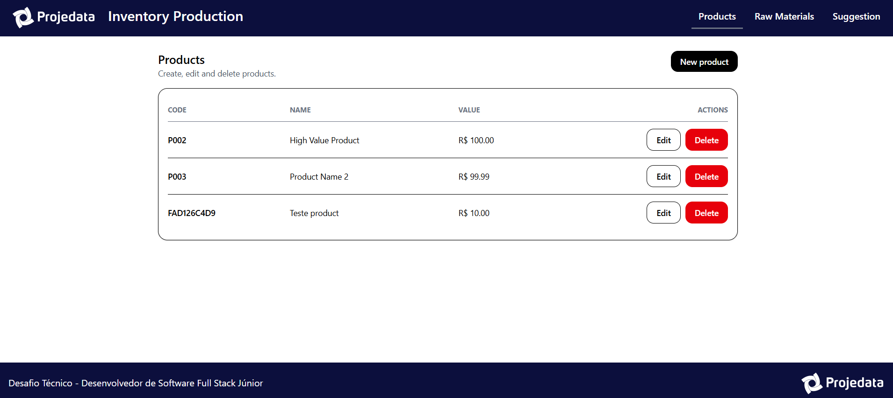
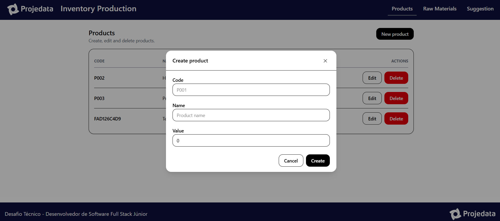
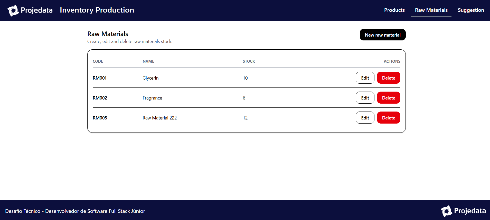
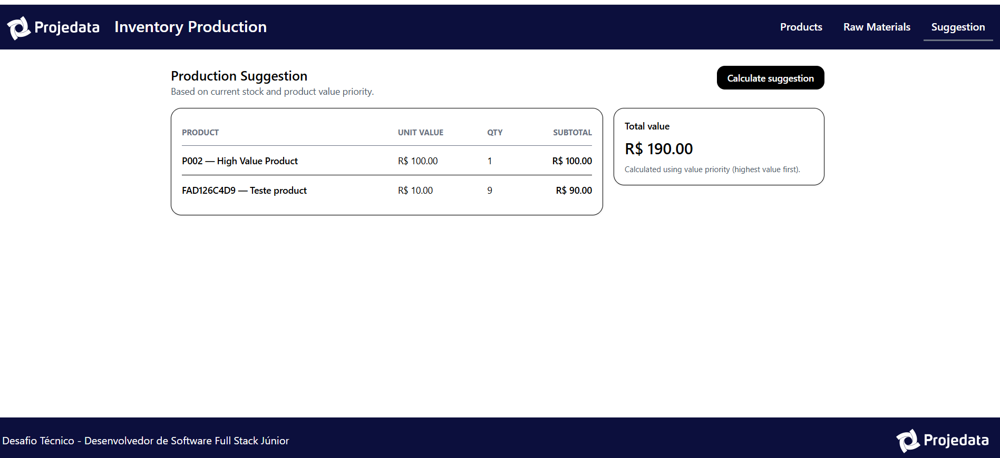

# Inventory Production System  
**Desafio Técnico – Desenvolvedor de Software Full Stack Júnior**

Desenvolvimento de um sistema web para controle de produtos, matérias-primas, composição de produtos (BOM – Bill of Materials) e sugestão de produção com base no estoque disponível, priorizando produtos de maior valor.

---

## 📌 Objetivo do projeto

Atender ao desafio técnico proposto, desenvolvendo uma aplicação **full stack**, com separação entre **back-end (API)** e **front-end**, que permita:

- Cadastrar produtos
- Cadastrar matérias-primas e controlar estoque
- Associar matérias-primas aos produtos (BOM)
- Calcular automaticamente quais produtos podem ser produzidos, considerando:
  - Estoque disponível
  - Quantidade necessária de cada matéria-prima
  - Prioridade por produtos de maior valor

---

## 🧱 Arquitetura

O projeto foi dividido em duas aplicações independentes:
```bash
inventory-production-system/
├── api/ → Back-end (API REST)
├── web/ → Front-end (React)
└── docker-compose.yml → Banco de dados
```

- **Back-end:** API REST em Node.js
- **Front-end:** React
- **Banco de dados:** PostgreSQL (via Docker)

---

## 🛠️ Tecnologias utilizadas

### Back-end
- Node.js
- Express
- TypeScript
- Prisma ORM
- PostgreSQL
- Docker / Docker Compose

### Front-end
- React
- TypeScript
- Vite
- Tailwind CSS

### Testes
- Jest (testes unitários do algoritmo)
- Cypress (testes end-to-end)

---

## 📋 Requisitos atendidos

### Requisitos não funcionais
- ✅ Aplicação web compatível com navegadores modernos
- ✅ Arquitetura baseada em API (back-end separado do front-end)
- ✅ Interface responsiva
- ✅ Persistência em banco de dados relacional (PostgreSQL)
- ✅ Código escrito em inglês (API, banco e front)

### Requisitos funcionais
- ✅ CRUD de produtos
- ✅ CRUD de matérias-primas
- ✅ Associação de matérias-primas aos produtos (BOM)
- ✅ Cálculo de sugestão de produção
- ✅ Interface gráfica para todas as operações
- ✅ Priorização de produtos de maior valor

---

## ⚙️ Algoritmo de sugestão de produção

A sugestão de produção utiliza a estratégia:

1. Ordena os produtos por **valor unitário (decrescente)**.
2. Para cada produto:
   - Calcula o máximo que pode ser produzido:
     ```
     min(estoque_disponível / quantidade_necessária)
     ```
3. Deduz o estoque utilizado.
4. Continua para o próximo produto.
5. Retorna:
   - Lista de produtos sugeridos
   - Quantidade de cada produto
   - Valor total da produção

Esse algoritmo foi **testado com testes unitários**.

---

## 🧪 Testes

### Testes unitários (Back-end)
- Implementados com **Jest**
- Testam o serviço de sugestão de produção
- Validam:
  - Priorização por maior valor
  - Cálculo correto de quantidades
  - Cálculo do valor total

Rodar testes:
```bash
cd api
npm test
```

### Testes E2E (Front-end)

- Implementados com **Cypress**
- Testes cobrem:
    - Criação de produtos
    - Listagem de produtos
    - Cálculo da sugestão de produção

Rodar Cypress:
```bash
cd web
npx cypress open
```

--- 

## ▶️ Como executar o projeto localmente

1️⃣ Subir o banco de dados

Na raiz do projeto:
```bash
docker compose up -d
```

2️⃣ Back-end (API)
```bash
cd api
npm install
npm run dev
```

- API: http://localhost:3333
- Health check: http://localhost:3333/health

3️⃣ Front-end (Web)
```bash
cd web
npm install
npm run dev
```

- Aplicação: http://localhost:5173

---

## 🧠 Decisões técnicas

- Node.js + TypeScript: maior produtividade e segurança de tipos
- Prisma ORM: facilidade de modelagem e migrations
- Tailwind CSS: agilidade e consistência visual
- Modais reutilizáveis: melhor UX e código organizado
- Testes automatizados: garantia de qualidade e previsibilidade

---

## 📦 Funcionalidades principais da interface

- CRUD de produtos com modal
- CRUD de matérias-primas com modal
- Editor de BOM dentro do modal de edição de produto
- Tela de sugestão de produção com:
    - Tabela de produtos
    - Quantidades sugeridas
    - Valor total

---

## 🖼️ Capturas de tela

### Tela de Produtos


### Modal de criação de novos produtos


### Tela de matérias primas



### Sugestão de Produção


---

👩‍💻 Autora

Projeto desenvolvido como parte de um desafio técnico full stack, com foco em:
- boas práticas
- organização de código
- clareza de regras de negócio
- experiência do usuário

Desenvolvido por: Elane Alencar
- Linkedin: https://linkedin.com/in/elanealencar
- GitHub: https://github.com/elanealencar
- Portfólio pessoal: https://portfolio-elanealencar.vercel.app/